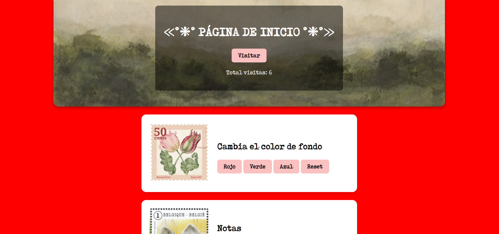
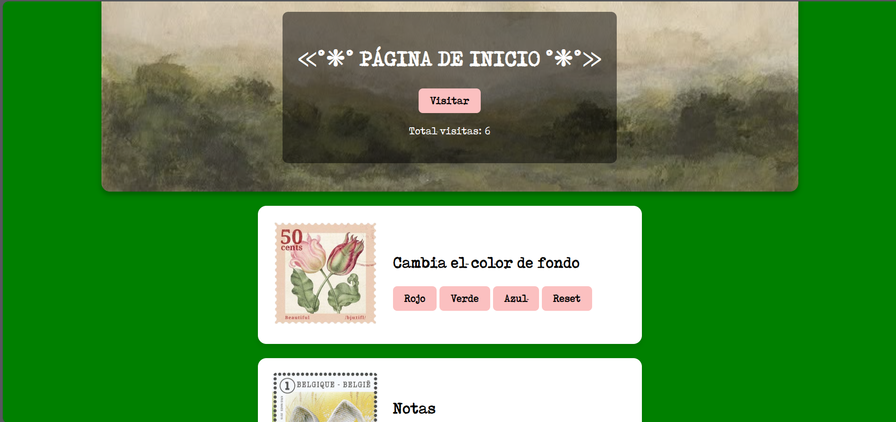
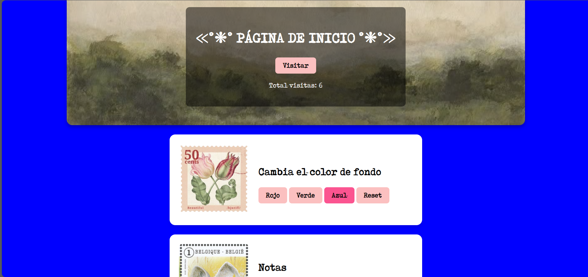
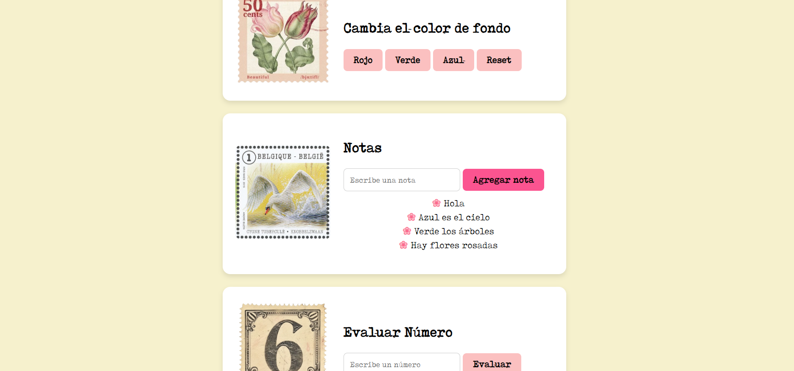
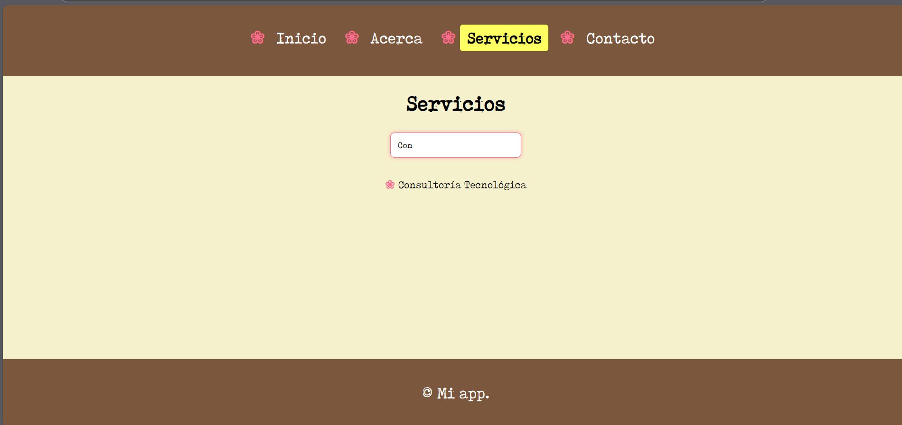
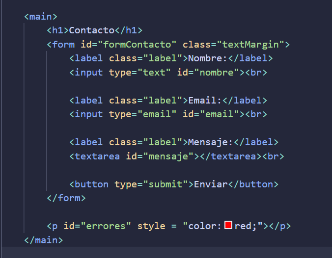
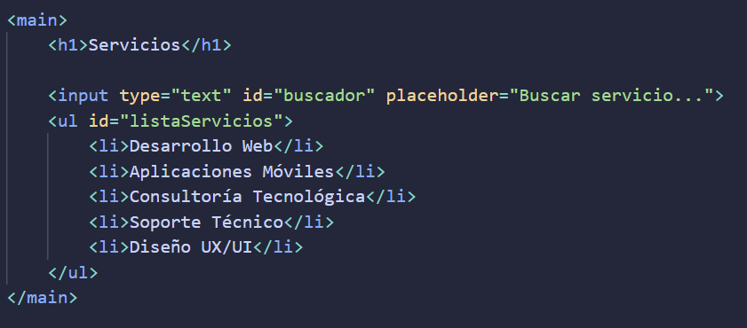
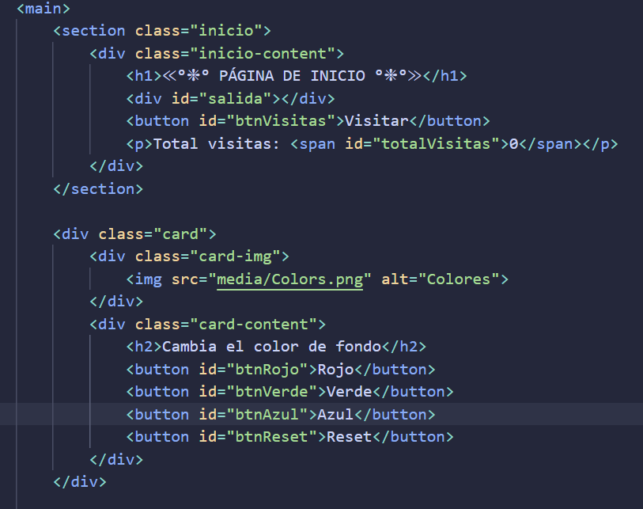
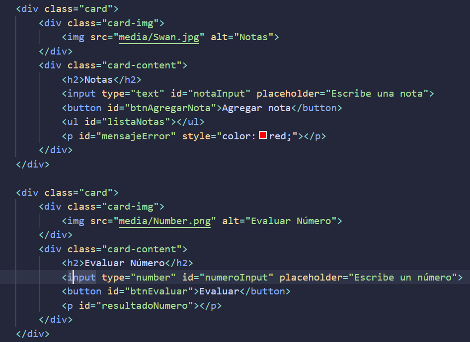
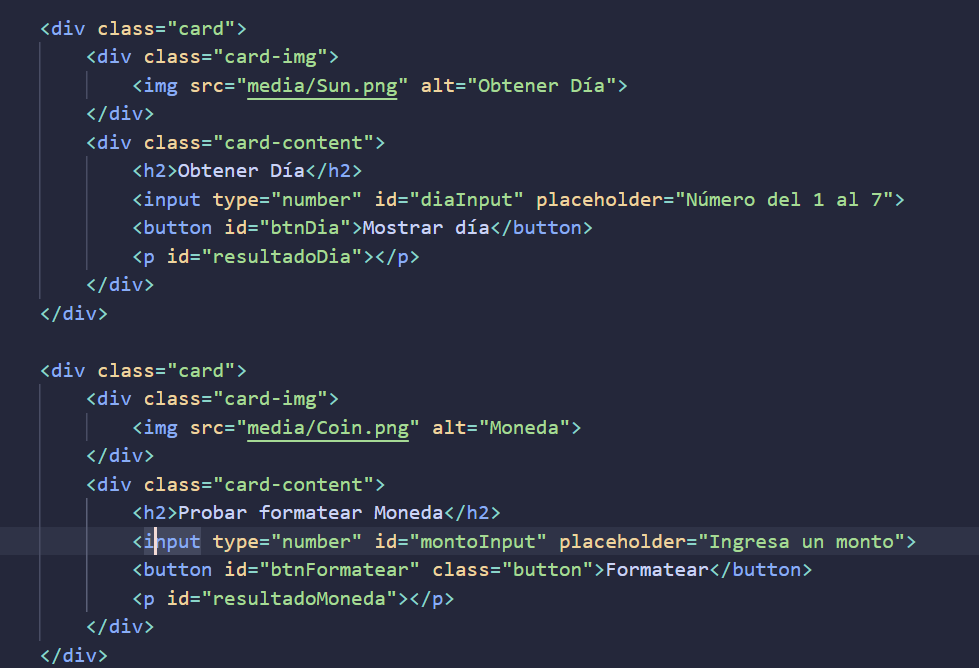

# 📌 Proyecto: u4-js-sitio

Este proyecto consiste en la creación de un sitio web con HTML, CSS y JavaScript para practicar conceptos de DOM, eventos, funciones, clases y almacenamiento local.

## ✅ Checklist de requisitos

- [x] **Repositorio GitHub público** llamado exactamente `u4-js-sitio`.
- [x] Crear carpeta `/js` y archivo `app.js` enlazado en todas las páginas.
- [x] Declarar constantes: `APP_NOMBRE`, `APP_VERSION`, `ANIO`.
- [x] Variables con `let`: `contadorVisitas`, `usuarioActivo`, `esMovil`.
- [x] Funciones `sumar()` y `multiplicar()`.
- [x] Mostrar mensaje de bienvenida en `#salida` con *template string*.
- [x] Botón con contador de visitas y actualización en `#totalVisitas`.
- [x] Función `mostrarHora()` con reloj en el header.
- [x] Navegación activa usando `data-page` y clase `activo`.
- [x] **DOM básico**: cambio de color con botones (rojo, verde, azul).
- [x] **DOM avanzado**: lista de notas con validación de input.
- [x] Validación de formulario en `contacto.html` con mensajes de error.
- [x] Mensaje de éxito al enviar formulario válido.
- [x] Buscador en `servicios.html` con coincidencias en tiempo real.
- [x] Función `evaluarNumero(n)` con `if/else`.
- [x] Función `obtenerDia(numero)` con `switch`.
- [x] Renderizar perfil en `acerca.html` usando *template string*.
- [x] LocalStorage para visitas.
- [x] Clase `Util` con método `formatearMoneda()`.
- [x] Entrega con **README.md** y capturas de pantalla del sitio.

## Capturas de pantalla

